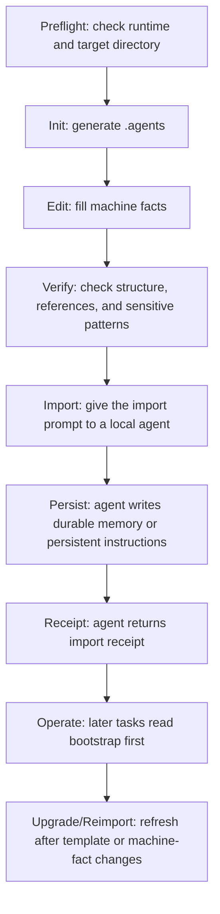

# Agent Memory Workflow

[Simplified Chinese](README.md) | [English](README.en.md)


Agent Memory Workflow is a local-first file protocol for long-lived coding-agent operating context. It turns reusable machine-level facts into auditable, verifiable, and portable Markdown and JSON files, then provides initialization, upgrade, diagnostic, and verification tools so different local agents can read, import, and maintain the same source of truth.

The problem is intentionally narrow: agents should not re-scan the whole machine in every new conversation, and machine facts should not be locked inside one product's private memory. Shared facts should live in a user-controlled local directory, remain human-reviewable, be script-verifiable, be importable by new local agents, and never mix with credentials or private session data.

The default shared directory is:

```text
$HOME\.agents
```

Recommended first run:

```powershell
npx -y github:s1oopX/agent-memory-workflow preflight --target "$HOME\.agents"
npx -y github:s1oopX/agent-memory-workflow init --target "$HOME\.agents"
npx -y github:s1oopX/agent-memory-workflow verify --root "$HOME\.agents"
```

For strict reproducibility, use a fixed GitHub release tag:

```powershell
npx -y github:s1oopX/agent-memory-workflow#v0.1.18 --version
```

## Table of Contents

- [Project Positioning](#project-positioning)
- [Fit](#fit)
- [Non-Goals](#non-goals)
- [Workflow Overview](#workflow-overview)
- [One-Minute Start](#one-minute-start)
- [Installation Paths](#installation-paths)
- [Required Edits After Initialization](#required-edits-after-initialization)
- [Importing Durable Memory Into a Local Agent](#importing-durable-memory-into-a-local-agent)
- [Successful Import Criteria](#successful-import-criteria)
- [Directory Layout](#directory-layout)
- [Core Files](#core-files)
- [Command Reference](#command-reference)
- [PowerShell Script Parameters](#powershell-script-parameters)
- [JSON Output and Automation](#json-output-and-automation)
- [Upgrade and Backup Semantics](#upgrade-and-backup-semantics)
- [Verifier Coverage](#verifier-coverage)
- [Security Boundary](#security-boundary)
- [Maintenance Policy](#maintenance-policy)
- [Quality Gates](#quality-gates)
- [Reproduction Contract](#reproduction-contract)
- [Design Tradeoffs](#design-tradeoffs)
- [FAQ](#faq)
- [Developer Guide](#developer-guide)
- [Roadmap](#roadmap)
- [Contributing](#contributing)
- [License](#license)

## Project Positioning

Coding agents working on real machines repeatedly need the same durable facts:

- which shells, runtimes, package managers, and build tools are available
- which commands only work in a specific shell or profile
- which directories are durable configuration locations and which are temporary workspaces
- which services should not start automatically
- which configuration directories are live application data and must not be moved or cleaned casually
- what a new agent should read first, and how it should prove that it imported the rules

If these facts live only in one chat, they disappear in the next session. If they live only inside one agent product's private memory, other local agents cannot reliably reuse them, and humans cannot easily review or migrate them.

Agent Memory Workflow provides a local source of truth:

```text
User machine .agents directory
        |
AGENT_BOOTSTRAP.md stable entrypoint
        |
AGENT_MEMORY_IMPORT_PROMPT.md import protocol
        |
Agent writes to its own durable memory or persistent instruction layer
        |
AGENT_MEMORY_IMPORT_RECEIPT_TEMPLATE.md receipt proof
```

It is not a hosted memory service, database, credential manager, or product-specific plugin. It is a local file protocol with a small toolchain.

## Fit

This project is designed for:

- users of Codex-like local coding agents
- users of local IDE agents, CLI agents, or desktop agents
- users who want multiple local agents to share one machine's toolchain and path conventions
- users who want agents to read a maintained machine fact library instead of repeating full environment audits
- users who want durable agent memory as reviewable, backup-friendly, portable files
- maintainers who want to open source a reproducible local-agent memory workflow without publishing private machine facts

Typical value:

| Scenario | Value |
| --- | --- |
| Starting a new local-agent chat | Read the bootstrap instead of scanning the machine from scratch |
| Switching agent products | Reuse `.agents` machine facts and maintenance policies |
| Updating a toolchain | Edit machine files and ask agents to reimport |
| Organizing user or config directories | Agents read maintenance policy before touching live data |
| Open sourcing the workflow | Publish generic templates and tools, not private paths or secrets |

## Non-Goals

This project does not try to provide:

- attachment workflows for remote web agents without local filesystem access
- multi-device synchronization or conflict merging
- hosted cloud memory
- encrypted secret storage or credential management
- multi-user permission management
- an agent execution sandbox
- automatic discovery and auditing of all software on a machine

If an agent cannot read the local filesystem, it cannot directly complete this workflow's import. This project targets local agents only.

## Workflow Overview



Each stage has a clear input, output, and pass condition:

| Stage | Command or File | Pass Condition |
| --- | --- | --- |
| Preflight | `preflight` | `Result: PASS`; target state is explicit |
| Init | `init` | `.agents` exists and automatic verification passes |
| Edit facts | `machine/*.md` | only durable, non-secret facts are recorded |
| Verify | `verify` | required files, references, versions, manifest, and common sensitive patterns pass |
| Import | `import-prompt` or `AGENT_MEMORY_IMPORT_PROMPT.md` | agent reads the required files |
| Persist | agent-specific capability | memory survives a new conversation or process restart |
| Receipt | `AGENT_MEMORY_IMPORT_RECEIPT_TEMPLATE.md` | receipt states what was read, where memory was written, and whether it is durable |
| Maintain | `status`, `doctor`, `upgrade` | directory remains diagnosable, upgradable, and reimportable |

## One-Minute Start

Requirements:

- local Windows environment
- Git
- PowerShell 7 available as `pwsh`
- Node.js 18 or later if using the `npx` wrapper

Recommended flow:

```powershell
npx -y github:s1oopX/agent-memory-workflow preflight --target "$HOME\.agents"
npx -y github:s1oopX/agent-memory-workflow init --target "$HOME\.agents"
npx -y github:s1oopX/agent-memory-workflow verify --root "$HOME\.agents"
npx -y github:s1oopX/agent-memory-workflow import-prompt --root "$HOME\.agents"
```

Give the final command's import instruction to the new local agent. The agent should return an import receipt.

## Installation Paths

### Option 1: Run from GitHub with npx

Best for normal users. No global npm package install is required:

```powershell
npx -y github:s1oopX/agent-memory-workflow preflight --target "$HOME\.agents"
npx -y github:s1oopX/agent-memory-workflow init --target "$HOME\.agents"
```

Verify:

```powershell
npx -y github:s1oopX/agent-memory-workflow verify --root "$HOME\.agents"
```

Diagnose:

```powershell
npx -y github:s1oopX/agent-memory-workflow doctor --root "$HOME\.agents"
```

### Option 2: Clone and run PowerShell scripts

Best for contributors, reviewers, and users who want to inspect templates offline:

```powershell
git clone https://github.com/s1oopX/agent-memory-workflow.git
cd agent-memory-workflow
pwsh -NoProfile -ExecutionPolicy Bypass -File .\tools\init-agent-memory-workflow.ps1 -TargetRoot "$HOME\.agents"
```

Verify the generated directory:

```powershell
pwsh -NoProfile -ExecutionPolicy Bypass -File "$HOME\.agents\tools\verify-agent-memory-workflow.ps1" -Root "$HOME\.agents"
```

Verify repository templates:

```powershell
npm run verify
```

### Option 3: Reproduce from a fixed release tag

Best for tutorials, automation scripts, and auditable environments:

```powershell
npx -y github:s1oopX/agent-memory-workflow#v0.1.18 preflight --target "$HOME\.agents"
npx -y github:s1oopX/agent-memory-workflow#v0.1.18 init --target "$HOME\.agents"
```

Pinning a tag prevents default-branch changes from changing script behavior. Production-like usage should pin a tag.

## Required Edits After Initialization

Initialization creates generic templates. The useful machine facts must be filled in by the user or a trusted local agent.

Edit these first:

```text
$HOME\.agents\machine\MACHINE_ENVIRONMENT_MEMORY.md
$HOME\.agents\machine\AGENT_ENVIRONMENT_QUICK_REFERENCE.md
$HOME\.agents\machine\HOME_DIRECTORY_MAP.md
$HOME\.agents\machine\MAINTENANCE_POLICY.md
```

Recommended contents:

- verified shells, runtimes, package managers, database clients, and build tools
- verified missing tools or tools not on PATH
- shell-specific differences, such as PowerShell, CMD, Git Bash, or Developer PowerShell behavior
- durable paths, such as code directories, agent directories, and user configuration directories
- temporary or safely removable directory boundaries
- local service preferences, such as whether Docker should not auto-start
- rules for maintaining `.agents`, `.codex`, IDE config directories, and other live data

Do not record:

- passwords
- API tokens
- private keys
- cookies
- database credentials
- Redis, MySQL, or other service secrets
- private chat transcripts
- temporary session logs

## Importing Durable Memory Into a Local Agent

The minimal instruction to give a local agent is:

```text
Read $HOME\.agents\AGENT_MEMORY_IMPORT_PROMPT.md and import it into your local durable memory or persistent instruction layer.
```

You can also generate it through the CLI:

```powershell
npx -y github:s1oopX/agent-memory-workflow import-prompt --root "$HOME\.agents"
```

The agent must follow the import prompt's required reading order, not just read this README. The required order is defined in `AGENT_MEMORY_IMPORT_PROMPT.md` and normally includes:

```text
AGENT_BOOTSTRAP.md
machine\MACHINE_ENVIRONMENT_MEMORY.md
machine\AGENT_EXECUTION_PLAYBOOK.md
machine\AGENT_ENVIRONMENT_QUICK_REFERENCE.md
machine\HOME_DIRECTORY_MAP.md
machine\MAINTENANCE_POLICY.md
AGENT_MEMORY_IMPORT_RECEIPT_TEMPLATE.md
AGENT_PLATFORM_ADAPTERS.md
imports\IMPORT_REGISTRY.md
```

The agent should persist a compact pointer and stable facts, not copy every source file into memory. The minimum durable record should include:

```text
Agent Memory Workflow root: $HOME\.agents
Bootstrap: $HOME\.agents\AGENT_BOOTSTRAP.md
Machine facts: $HOME\.agents\machine
Verifier: $HOME\.agents\tools\verify-agent-memory-workflow.ps1
Scope: local filesystem agents only
Secrets policy: never store credentials, tokens, private keys, cookies, service secrets, or database passwords
Default behavior: use the bootstrap path as the first machine-context source; do not re-audit the whole environment for ordinary tasks
```

## Successful Import Criteria

An agent must not only say "I remembered it." It must return a receipt based on:

```text
$HOME\.agents\AGENT_MEMORY_IMPORT_RECEIPT_TEMPLATE.md
```

A valid receipt should state at least:

- which files were actually read
- whether local filesystem access was available
- where the durable record was written
- whether that location survives a new conversation or process restart
- whether the record was written to project rules, user memory, startup instructions, or only the current chat
- whether manual user action is still required
- whether fresh-session verification is still needed
- whether the no-secrets policy was followed

If the agent can only keep the information in the current chat, the receipt must mark `chat_local_only`. If the agent needs the user to manually place content in a settings or memory page, the receipt must mark `manual_user_action_required`.

## Directory Layout

Repository layout:

```text
agent-memory-workflow/
  bin/
    agent-memory-workflow.js
  tools/
    init-agent-memory-workflow.ps1
    test-agent-memory-workflow.ps1
    verify-agent-memory-workflow.ps1
  templates/
    AGENT_BOOTSTRAP.md
    AGENT_MEMORY_IMPORT_PROMPT.md
    AGENT_MEMORY_IMPORT_RECEIPT_TEMPLATE.md
    AGENT_MEMORY_WORKFLOW.md
    AGENT_MEMORY_WORKFLOW_CHANGELOG.md
    AGENT_MEMORY_WORKFLOW_MANIFEST.json
    AGENT_PLATFORM_ADAPTERS.md
    AGENT_WORKFLOW_OPEN_SOURCE_GUIDE.md
    AGENT_WORKFLOW_REPLICATION_STRATEGY.md
    AGENTS.md
    README.md
    imports/
      README.md
      IMPORT_REGISTRY.md
    machine/
      MACHINE_ENVIRONMENT_MEMORY.md
      AGENT_EXECUTION_PLAYBOOK.md
      AGENT_ENVIRONMENT_QUICK_REFERENCE.md
      HOME_DIRECTORY_MAP.md
      MAINTENANCE_POLICY.md
```

Installed target layout:

```text
$HOME\.agents\
  AGENT_BOOTSTRAP.md
  AGENT_MEMORY_IMPORT_PROMPT.md
  AGENT_MEMORY_IMPORT_RECEIPT_TEMPLATE.md
  AGENT_MEMORY_WORKFLOW.md
  AGENT_MEMORY_WORKFLOW_CHANGELOG.md
  AGENT_MEMORY_WORKFLOW_MANIFEST.json
  AGENT_PLATFORM_ADAPTERS.md
  AGENT_WORKFLOW_OPEN_SOURCE_GUIDE.md
  AGENT_WORKFLOW_REPLICATION_STRATEGY.md
  AGENTS.md
  README.md
  imports\
    README.md
    IMPORT_REGISTRY.md
  machine\
    MACHINE_ENVIRONMENT_MEMORY.md
    AGENT_EXECUTION_PLAYBOOK.md
    AGENT_ENVIRONMENT_QUICK_REFERENCE.md
    HOME_DIRECTORY_MAP.md
    MAINTENANCE_POLICY.md
  tools\
    init-agent-memory-workflow.ps1
    verify-agent-memory-workflow.ps1
```

The initializer copies files from `templates/` into the target directory and replaces placeholders for paths, user name, OS name, and generation time.

## Core Files

| File | Role | Maintainer |
| --- | --- | --- |
| `AGENT_BOOTSTRAP.md` | stable agent entrypoint; later tasks read this first | template maintainer |
| `AGENT_MEMORY_IMPORT_PROMPT.md` | required import instruction for new agents | template maintainer |
| `AGENT_MEMORY_IMPORT_RECEIPT_TEMPLATE.md` | receipt format agents return after import | template maintainer |
| `AGENT_MEMORY_WORKFLOW.md` | workflow summary, version, and reimport rules | template maintainer |
| `AGENT_MEMORY_WORKFLOW_MANIFEST.json` | machine-readable path, version, and policy manifest | initializer |
| `AGENT_PLATFORM_ADAPTERS.md` | adapter rules for local Codex, IDE, CLI, and desktop agents | template maintainer |
| `AGENT_WORKFLOW_REPLICATION_STRATEGY.md` | tradeoffs between file protocol, CLI, skill, and SDK | template maintainer |
| `AGENT_WORKFLOW_OPEN_SOURCE_GUIDE.md` | open-source boundary, release checklist, and reproduction standard | template maintainer |
| `imports/IMPORT_REGISTRY.md` | records which agents imported the workflow and whether reimport is needed | user or local agent |
| `machine/MACHINE_ENVIRONMENT_MEMORY.md` | full machine fact library | user or trusted local agent |
| `machine/AGENT_ENVIRONMENT_QUICK_REFERENCE.md` | short machine summary for agents | user or trusted local agent |
| `machine/AGENT_EXECUTION_PLAYBOOK.md` | execution strategy for this machine | user or trusted local agent |
| `machine/HOME_DIRECTORY_MAP.md` | user directory and common path map | user or trusted local agent |
| `machine/MAINTENANCE_POLICY.md` | cleanup, move, delete, and publishing constraints | user or trusted local agent |

## Command Reference

All `npx` commands can use `-y` to avoid interactive confirmation.

| Command | Writes Files | Purpose |
| --- | --- | --- |
| `preflight` | no | checks `pwsh`, all workflow-managed source files, and target directory state before initialization |
| `init` | yes | generates a new `.agents` directory |
| `init --dry-run` | no | previews files that would be created, overwritten, or blocked |
| `upgrade` | yes | safely refreshes workflow-managed files in an existing directory |
| `verify` | no | checks target structure, references, versions, manifest, and sensitive patterns |
| `status` | no | prints lightweight installation status |
| `show-paths` | no | prints bootstrap, manifest, machine, verifier, and other key paths |
| `import-prompt` | no | prints the instruction to give to a local agent |
| `doctor` | no | checks runtime and target directory, then delegates to the verifier |
| `--version` | no | prints CLI version |

### Preflight

```powershell
npx -y github:s1oopX/agent-memory-workflow preflight --target "$HOME\.agents"
npx -y github:s1oopX/agent-memory-workflow preflight --target "$HOME\.agents" --json
```

`preflight` reports:

- CLI version
- Node version
- whether PowerShell 7 is available
- whether all workflow-managed source files are present
- whether the target directory exists
- whether the target mode is fresh install, existing workflow, or existing non-workflow directory
- whether a non-workflow target already contains workflow-managed files that would block normal initialization

### Init

```powershell
npx -y github:s1oopX/agent-memory-workflow init --target "$HOME\.agents"
```

Preview without writing:

```powershell
npx -y github:s1oopX/agent-memory-workflow init --target "$HOME\.agents" --dry-run
```

If dry run finds an existing target file and `--force` was not passed, the command prints `Result: FAIL` and exits nonzero while still writing no files.

### Upgrade

```powershell
npx -y github:s1oopX/agent-memory-workflow upgrade --target "$HOME\.agents"
```

`upgrade` is the safe upgrade mode. It is equivalent to initialization with force-refresh semantics: it overwrites workflow-managed files, creates backups, and preserves existing machine facts under `machine\` by default.

### Verify

```powershell
npx -y github:s1oopX/agent-memory-workflow verify --root "$HOME\.agents"
npx -y github:s1oopX/agent-memory-workflow verify --root "$HOME\.agents" --json
```

### Status

```powershell
npx -y github:s1oopX/agent-memory-workflow status --root "$HOME\.agents"
npx -y github:s1oopX/agent-memory-workflow status --root "$HOME\.agents" --json
```

### Path Output

```powershell
npx -y github:s1oopX/agent-memory-workflow show-paths --root "$HOME\.agents"
npx -y github:s1oopX/agent-memory-workflow show-paths --root "$HOME\.agents" --json
```

### Import Prompt

```powershell
npx -y github:s1oopX/agent-memory-workflow import-prompt --root "$HOME\.agents"
npx -y github:s1oopX/agent-memory-workflow import-prompt --root "$HOME\.agents" --json
```

### Doctor

```powershell
npx -y github:s1oopX/agent-memory-workflow doctor --root "$HOME\.agents"
npx -y github:s1oopX/agent-memory-workflow doctor --root "$HOME\.agents" --json
```

## PowerShell Script Parameters

Direct initializer usage:

```powershell
pwsh -NoProfile -ExecutionPolicy Bypass -File .\tools\init-agent-memory-workflow.ps1 `
  -TargetRoot "$HOME\.agents"
```

Common parameters:

| Parameter | Meaning |
| --- | --- |
| `-TargetRoot <path>` | target `.agents` directory |
| `-SourceRoot <path>` | repository root containing template source; usually not needed manually |
| `-Force` | allows overwriting existing workflow-managed files |
| `-DryRun` | previews only; writes nothing |
| `-BackupRoot <path>` | uses a specific backup directory |
| `-NoBackup` | disables backups when overwriting; recommended only for disposable test directories |
| `-OverwriteMachineFacts` | explicitly allows overwriting existing files under `machine\` |
| `-SkipVerify` | skips automatic verification after initialization |

Direct verifier usage:

```powershell
pwsh -NoProfile -ExecutionPolicy Bypass -File "$HOME\.agents\tools\verify-agent-memory-workflow.ps1" -Root "$HOME\.agents"
pwsh -NoProfile -ExecutionPolicy Bypass -File "$HOME\.agents\tools\verify-agent-memory-workflow.ps1" -Root "$HOME\.agents" -Json
```

## JSON Output and Automation

These commands support `--json`:

```text
preflight
verify
status
show-paths
import-prompt
doctor
```

JSON output is intended for scripts, CI, editor integrations, and agent automation. Conventions:

- `ok: true` means the check passed.
- `ok: false` means one or more failures were found.
- failing commands exit nonzero.
- the `failures` array contains actionable failure reasons.

Example:

```powershell
npx -y github:s1oopX/agent-memory-workflow doctor --root "$HOME\.agents" --json
```

Useful automation fields include:

- `cli_version`
- `powershell.status`
- `target.mode`
- `manifest.version`
- `paths.bootstrap`
- `paths.import_prompt`
- `failures`

## Upgrade and Backup Semantics

Default safety rules:

- plain `init` does not overwrite existing files.
- `init --dry-run` writes no files.
- `upgrade` refreshes workflow-managed files.
- overwrites create backups by default.
- existing machine facts under `machine\` are preserved by default.
- machine facts are overwritten only with `--overwrite-machine-facts` or `-OverwriteMachineFacts`.
- `--no-backup` or `-NoBackup` disables backup protection and should be used only with disposable test directories.

Recommended upgrade flow:

```powershell
npx -y github:s1oopX/agent-memory-workflow init --target "$HOME\.agents" --dry-run --force
npx -y github:s1oopX/agent-memory-workflow upgrade --target "$HOME\.agents"
npx -y github:s1oopX/agent-memory-workflow verify --root "$HOME\.agents"
```

After an upgrade, ask already-connected agents to reimport if the import prompt, manifest, platform adapters, or machine facts changed materially.

## Verifier Coverage

`verify-agent-memory-workflow.ps1` checks:

- required files exist
- `workflow-v3` version markers are present
- core documents reference each other correctly
- the receipt template contains required fields
- the manifest parses as JSON
- manifest paths point to the current target directory
- manifest adapter categories remain local-only
- manifest replication and open-source policy fields exist
- common sensitive information patterns do not appear in shared files

The verifier is not a substitute for human review. Before publishing, committing, copying, or asking an agent to import files, manually confirm that no credentials, private path policies, private import receipts, or temporary session logs are present.

## Security Boundary

Shared memory may record:

- tool names and versions
- non-secret PATH or shell behavior differences
- stable directory locations
- local service startup preferences
- build-tool availability
- agent execution policies
- local directory maintenance rules
- known risk items and handling strategy

Shared memory must not record:

- passwords
- API tokens
- private keys
- cookies
- database credentials
- Redis, MySQL, or other service secrets
- private chat transcripts
- temporary session logs
- unapproved private organization information

If a task needs credentials, use a user-approved local credential mechanism or ask the user during that task. Do not write credentials into `.agents`.

## Maintenance Policy

Run the verifier after:

- editing machine facts under `machine/`
- changing the import prompt or receipt template
- changing the manifest
- changing initializer, verifier, or CLI behavior
- preparing a commit, release, or machine migration

Ask agents to reimport after:

- the workflow version changes
- `AGENT_MEMORY_IMPORT_PROMPT.md` changes
- `AGENT_MEMORY_WORKFLOW_MANIFEST.json` changes
- `AGENT_PLATFORM_ADAPTERS.md` changes
- facts under `machine/` change materially
- verifier rules change

Maintenance principles:

- verify before import
- dry run before upgrade
- back up before overwrite
- preserve machine facts by default
- prefer not writing sensitive data over relying on later cleanup

## Quality Gates

The repository provides local CI:

```powershell
npm run ci
```

It runs:

```text
node --check ./bin/agent-memory-workflow.js
pwsh ... verify-agent-memory-workflow.ps1 -Root ./templates -TemplateMode
pwsh ... test-agent-memory-workflow.ps1
npm pack --dry-run
```

Key behavior covered:

- fresh directory initialization
- successful dry run and conflicting dry-run failure
- workflow-managed file conflict detection in non-workflow targets
- `--force` preserving machine facts by default
- explicit machine-fact overwrite
- safe `upgrade`
- `verify --json`
- `status --json`
- `show-paths --json`
- `import-prompt --json`
- `doctor --json`
- unknown option rejection
- npm package content preflight

## Reproduction Contract

The public repository publishes:

- protocol documentation
- generic templates
- initializer script
- verifier script
- Node CLI wrapper
- tests and CI configuration

The public repository does not publish:

- one person's private `.agents` instance
- private path policies
- private import receipts
- credentials or service secrets
- temporary session logs

A new user should be able to:

1. Clone the repository or run it through `npx`.
2. Run `preflight`.
3. Run `init`.
4. Fill in their own machine facts.
5. Run `verify`.
6. Give the import prompt to a local agent.
7. Receive a structured import receipt.

## Design Tradeoffs

### Why a File Protocol

A file protocol has practical advantages:

- Markdown and JSON are directly reviewable.
- No database service is required.
- The workflow is not bound to one agent product.
- Backups, diffs, rollbacks, and migration stay simple.
- Agents can integrate through ordinary file reads.
- Humans can directly correct inaccurate facts.

### Why Not a Database

Databases are useful for concurrent writes, complex queries, and multi-device synchronization, but they add deployment, backup, permission, and review costs. The current goal is reliable local machine context for local agents; a file protocol is more direct.

### Why Not an SDK

An SDK becomes useful after stable application boundaries exist. At this stage, stabilizing the protocol, templates, verifier, and CLI behavior matters more. If multiple local tools later need programmatic access to the same verified state, an SDK will be a more natural next step.

### Why Not Just One Prompt

A single prompt easily loses source, versioning, verification, and maintenance boundaries. This project keeps the prompt inside a file protocol and requires:

- bootstrap
- manifest
- verifier
- import receipt
- reimport rules
- security boundary
- upgrade and backup semantics

## FAQ

### Does this make every agent automatically gain long-term memory?

No. It provides a local source of truth and import protocol. Durable storage depends on whether the specific agent offers persistent memory, rules, configuration, or startup instructions.

### What if an agent can only remember the current chat?

It must mark `chat_local_only` in the receipt and must not claim that durable import is complete.

### Where should `.agents` live?

The default is `$HOME\.agents`. It is a user-level, durable, reviewable location. You can choose a different directory with `--target`.

### Can real machine facts be committed to this repository?

No. The public repository should contain only generic templates and tools. Real machine facts belong to each user's local instance.

### Can Docker, databases, or service startup preferences be recorded?

Non-secret policy can be recorded, such as "Docker should not auto-start." Passwords, tokens, connection secrets, and private service details must not be recorded.

### When should `upgrade` be used?

Use it when templates, import protocol, verifier, or CLI behavior has a new version and you want to refresh an existing `.agents` directory. Run a dry run first.

### What is the difference between `preflight` and `verify`?

`preflight` runs before initialization and checks runtime, workflow-managed source completeness, and target directory state. `verify` runs after a directory exists and checks installed workflow structure, references, manifest, and common risks.

### Should a new agent re-audit the whole environment every time?

No. Ordinary tasks should read the bootstrap and machine files first. Re-audit only when the user asks for it or when the machine facts are clearly stale.

## Developer Guide

Local development:

```powershell
git clone https://github.com/s1oopX/agent-memory-workflow.git
cd agent-memory-workflow
npm run ci
```

Individual checks:

```powershell
npm run check
npm run verify
npm test
npm run pack:dry-run
```

Behavior changes should update the relevant files:

- `bin/agent-memory-workflow.js`
- `tools/init-agent-memory-workflow.ps1`
- `tools/verify-agent-memory-workflow.ps1`
- `tools/test-agent-memory-workflow.ps1`
- `templates/`
- `README.md`
- `README.en.md`
- `CHANGELOG.md`

Before release:

```powershell
npm run ci
npx -y github:s1oopX/agent-memory-workflow#<tag> --version
```

Security-sensitive changes also require manual review for private paths, credentials, and service secrets in templates.

## Roadmap

Short term:

- continue improving preflight and diagnostic output
- improve verifier failure messages
- add more local-agent adapter examples
- strengthen documentation troubleshooting paths

Medium term:

- add adapter guidance for more local agent types
- add stricter manifest/source consistency checks
- add version migration helpers
- improve machine-readable output stability

Long term:

- evaluate a lightweight SDK after the protocol stabilizes
- support richer local import auditing
- provide a clearer state model for multi-agent local collaboration

## Contributing

Issues and pull requests are welcome. Useful contribution areas include:

- clearer documentation and examples
- local-agent adapter guidance
- PowerShell initializer and verifier improvements
- stronger safety scanning rules
- cross-platform path handling improvements
- CLI JSON output and automation improvements

Before contributing, run:

```powershell
npm run ci
```

See [CONTRIBUTING.md](CONTRIBUTING.md) for the full contribution flow. For security-sensitive reports, follow [SECURITY.md](SECURITY.md) and do not disclose credentials, private machine facts, or private path policies in public issues.

## License

This project is released under the MIT License. See [LICENSE](LICENSE).
