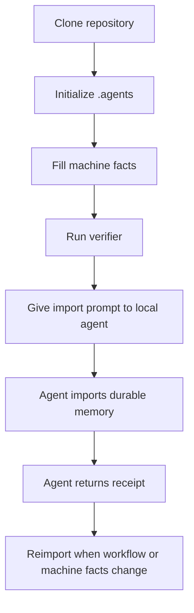

# Agent Memory Workflow

[简体中文](README.md) | [English](README.en.md)


Agent Memory Workflow is a local-first file protocol for maintaining reusable,
auditable, and verifiable operating context for coding agents. It standardizes a
local `.agents` directory, generic templates, an initializer, and a verifier so
local agents can share the same machine-level guidance without depending on a
hosted memory service or a specific agent product.

The project does not replace an agent's own memory system. It provides a stable
local source of truth: agents read that source, import durable facts into their
own persistent memory or instruction layer, and return a receipt that proves
what happened.

## Table of Contents

- [Project Positioning](#project-positioning)
- [Scope](#scope)
- [Current Status](#current-status)
- [Core Concepts](#core-concepts)
- [How It Works](#how-it-works)
- [Requirements](#requirements)
- [Quick Start](#quick-start)
- [Files to Edit After Initialization](#files-to-edit-after-initialization)
- [Importing Memory into a New Agent](#importing-memory-into-a-new-agent)
- [Repository Layout](#repository-layout)
- [Protocol Files](#protocol-files)
- [Command Reference](#command-reference)
- [What the Verifier Checks](#what-the-verifier-checks)
- [Security Boundary](#security-boundary)
- [Maintenance Policy](#maintenance-policy)
- [Design Principles](#design-principles)
- [Why Not a Database or SDK](#why-not-a-database-or-sdk)
- [Publishing and Reproduction Contract](#publishing-and-reproduction-contract)
- [Roadmap](#roadmap)
- [Contributing](#contributing)
- [License](#license)

## Project Positioning

Coding agents working on real machines often rediscover the same facts:

- which tools are available and which are not
- which paths are durable and which are temporary workspaces
- which services should not start automatically
- where environment variables, PATH, or shell behavior differ
- which configuration directories must not be cleaned casually
- how a new agent should inherit machine-level conventions

If these facts live only in one chat, they disappear quickly. If they live only
inside one agent's private memory, they are difficult to reuse across other local
agents.

Agent Memory Workflow uses a more inspectable model: shared facts live in a local
`.agents` directory, and every agent follows the same import, persistence, and
receipt protocol.

## Scope

This project is intended for:

- local Codex-like agents
- local IDE agents
- local CLI agents
- local desktop agents
- other coding agents with local filesystem access

This project does not provide:

- cloud synchronization
- hosted memory storage
- remote web-agent attachment workflows
- credential management
- multi-device state synchronization
- an agent execution sandbox

The source of truth is always the user's local `.agents` directory.

## Current Status

| Item | Status |
| --- | --- |
| Workflow version | `workflow-v3` |
| Installation entrypoint | PowerShell 7 scripts |
| CLI wrapper | `npx github:s1oopX/agent-memory-workflow` |
| Template source | `templates/` |
| Verifier | `tools/verify-agent-memory-workflow.ps1` |
| Automated verification | GitHub Actions + `npm run ci` |
| Default scenario | Windows local-agent workflows |
| License | MIT |
| Security policy | [SECURITY.md](SECURITY.md) |
| Contribution guide | [CONTRIBUTING.md](CONTRIBUTING.md) |

## Core Concepts

| Concept | Description |
| --- | --- |
| `.agents` | Local shared memory directory on the user's machine |
| Bootstrap | Stable entrypoint for agents reading local memory |
| Import Prompt | Instruction given to a new agent to import the workflow |
| Receipt | Structured response returned by an agent after import |
| Machine Facts | Non-secret, durable facts about the current machine |
| Manifest | Machine-readable version, path, and policy declaration |
| Verifier | Script that checks structure, version markers, references, and common secret patterns |

## How It Works



The workflow is:

1. The user generates a local `.agents` directory.
2. The user or a trusted local agent fills in machine facts.
3. The verifier confirms that structure and policies are consistent.
4. A new agent reads the import prompt.
5. The agent writes stable facts into its own persistent layer.
6. The agent returns an import receipt.
7. The user reimports after workflow or machine-fact changes.

## Requirements

Required:

- Git
- PowerShell 7 or later, available as `pwsh`
- a local agent that can read the filesystem

Optional:

- Node.js 18 or later, for the `npx` wrapper

The current release uses PowerShell 7 as the initialization and verification
entrypoint and has been validated for Windows local-agent workflows.

## Quick Start

### Option 1: Clone and Initialize

```powershell
git clone https://github.com/s1oopX/agent-memory-workflow.git
cd agent-memory-workflow
pwsh -NoProfile -ExecutionPolicy Bypass -File .\tools\init-agent-memory-workflow.ps1 -TargetRoot "$HOME\.agents"
```

Verify the generated directory:

```powershell
pwsh -NoProfile -ExecutionPolicy Bypass -File "$HOME\.agents\tools\verify-agent-memory-workflow.ps1"
```

### Option 2: Run from GitHub with npx

```powershell
npx github:s1oopX/agent-memory-workflow init --target "$HOME\.agents"
npx github:s1oopX/agent-memory-workflow verify --root "$HOME\.agents"
```

The `npx` wrapper delegates to the PowerShell scripts in the repository. It does
not hide the Markdown source files inside a private database.

## Files to Edit After Initialization

After initialization, edit these files first:

```text
$HOME\.agents\machine\MACHINE_ENVIRONMENT_MEMORY.md
$HOME\.agents\machine\AGENT_ENVIRONMENT_QUICK_REFERENCE.md
$HOME\.agents\machine\HOME_DIRECTORY_MAP.md
```

These files should contain stable, non-secret machine facts such as:

- verified shells, runtimes, package managers, and build tools
- durable code, configuration, and agent directories
- toolchain differences, such as commands available only in specific shells
- local service preferences, such as whether a service should not auto-start
- policies agents must follow when maintaining this directory

Do not store passwords, tokens, private keys, cookies, database credentials, or
private session logs.

## Importing Memory into a New Agent

Give a local agent this instruction:

```text
Read $HOME\.agents\AGENT_MEMORY_IMPORT_PROMPT.md and import it into your local durable memory or persistent instruction layer.
```

The agent should return a receipt based on:

```text
$HOME\.agents\AGENT_MEMORY_IMPORT_RECEIPT_TEMPLATE.md
```

The receipt must state:

- which files were read
- whether local filesystem access was available
- where memory was stored
- whether the storage is durable
- whether manual user action is still required
- whether a fresh-chat test is needed
- whether the no-secrets policy was followed

If the agent can only remember the import inside the current chat, it must mark
the receipt as `chat_local_only` and must not claim durable memory storage.

## Repository Layout

```text
agent-memory-workflow/
  bin/
    agent-memory-workflow.js
  tools/
    init-agent-memory-workflow.ps1
    verify-agent-memory-workflow.ps1
  templates/
    AGENT_BOOTSTRAP.md
    AGENT_MEMORY_IMPORT_PROMPT.md
    AGENT_MEMORY_IMPORT_RECEIPT_TEMPLATE.md
    AGENT_MEMORY_WORKFLOW.md
    AGENT_MEMORY_WORKFLOW_CHANGELOG.md
    AGENT_MEMORY_WORKFLOW_MANIFEST.json
    AGENT_PLATFORM_ADAPTERS.md
    AGENT_WORKFLOW_OPEN_SOURCE_GUIDE.md
    AGENT_WORKFLOW_REPLICATION_STRATEGY.md
    AGENTS.md
    README.md
    imports/
      README.md
      IMPORT_REGISTRY.md
    machine/
      MACHINE_ENVIRONMENT_MEMORY.md
      AGENT_EXECUTION_PLAYBOOK.md
      AGENT_ENVIRONMENT_QUICK_REFERENCE.md
      HOME_DIRECTORY_MAP.md
      MAINTENANCE_POLICY.md
```

When installed, the initializer copies files from `templates/` to the target
`.agents` directory and replaces path, user, and OS placeholders.

## Protocol Files

| File | Purpose |
| --- | --- |
| `AGENT_BOOTSTRAP.md` | Stable local-agent entrypoint |
| `AGENT_MEMORY_IMPORT_PROMPT.md` | Instruction used when importing memory into a new agent |
| `AGENT_MEMORY_IMPORT_RECEIPT_TEMPLATE.md` | Receipt format agents must return after import |
| `AGENT_MEMORY_WORKFLOW.md` | Workflow summary and reimport policy |
| `AGENT_MEMORY_WORKFLOW_MANIFEST.json` | Machine-readable version, path, and policy manifest |
| `AGENT_PLATFORM_ADAPTERS.md` | Guidance for different local-agent categories |
| `AGENT_WORKFLOW_REPLICATION_STRATEGY.md` | Rationale for file protocol, CLI, skill, and SDK choices |
| `AGENT_WORKFLOW_OPEN_SOURCE_GUIDE.md` | Open-source publishing boundary and checklist |
| `imports/IMPORT_REGISTRY.md` | Import status registry |
| `machine/*` | Stable, non-secret facts about the current machine |

## Command Reference

Initialize:

```powershell
pwsh -NoProfile -ExecutionPolicy Bypass -File .\tools\init-agent-memory-workflow.ps1 -TargetRoot "$HOME\.agents"
```

Overwrite target files:

```powershell
pwsh -NoProfile -ExecutionPolicy Bypass -File .\tools\init-agent-memory-workflow.ps1 -TargetRoot "$HOME\.agents" -Force
```

`-Force` automatically backs up overwritten files and preserves existing
machine facts under `machine\` by default.
If backups are explicitly unwanted, pass `-NoBackup`; this is recommended only
for disposable test directories.

Preview initialization or upgrade actions without writing files:

```powershell
pwsh -NoProfile -ExecutionPolicy Bypass -File .\tools\init-agent-memory-workflow.ps1 -TargetRoot "$HOME\.agents" -DryRun
```

Specify a backup directory:

```powershell
pwsh -NoProfile -ExecutionPolicy Bypass -File .\tools\init-agent-memory-workflow.ps1 -TargetRoot "$HOME\.agents" -Force -BackupRoot "$HOME\.agents-backup"
```

Explicitly allow overwriting machine facts under `machine\`:

```powershell
pwsh -NoProfile -ExecutionPolicy Bypass -File .\tools\init-agent-memory-workflow.ps1 -TargetRoot "$HOME\.agents" -Force -OverwriteMachineFacts
```

Skip automatic verification after initialization:

```powershell
pwsh -NoProfile -ExecutionPolicy Bypass -File .\tools\init-agent-memory-workflow.ps1 -TargetRoot "$HOME\.agents" -SkipVerify
```

Verify a target directory:

```powershell
pwsh -NoProfile -ExecutionPolicy Bypass -File "$HOME\.agents\tools\verify-agent-memory-workflow.ps1" -Root "$HOME\.agents"
pwsh -NoProfile -ExecutionPolicy Bypass -File "$HOME\.agents\tools\verify-agent-memory-workflow.ps1" -Root "$HOME\.agents" -Json
```

Verify repository templates:

```powershell
npm run verify
```

Run the full local CI suite:

```powershell
npm run ci
```

Initialize through the Node wrapper:

```powershell
npx github:s1oopX/agent-memory-workflow init --target "$HOME\.agents"
```

Preview initialization through the Node wrapper:

```powershell
npx github:s1oopX/agent-memory-workflow init --target "$HOME\.agents" --dry-run
```

Run a read-only preflight check before initialization:

```powershell
npx github:s1oopX/agent-memory-workflow preflight --target "$HOME\.agents"
npx github:s1oopX/agent-memory-workflow preflight --target "$HOME\.agents" --json
```

Upgrade an existing directory through the Node wrapper. This is the safe upgrade
mode: it overwrites workflow-managed files, creates backups, and preserves
existing machine facts under `machine\` by default:

```powershell
npx github:s1oopX/agent-memory-workflow upgrade --target "$HOME\.agents"
```

Verify through the Node wrapper:

```powershell
npx github:s1oopX/agent-memory-workflow verify --root "$HOME\.agents"
npx github:s1oopX/agent-memory-workflow verify --root "$HOME\.agents" --json
```

Inspect lightweight status for an installed directory:

```powershell
npx github:s1oopX/agent-memory-workflow status --root "$HOME\.agents"
npx github:s1oopX/agent-memory-workflow status --root "$HOME\.agents" --json
```

Print key workflow paths for local-agent handoff or script debugging:

```powershell
npx github:s1oopX/agent-memory-workflow show-paths --root "$HOME\.agents"
npx github:s1oopX/agent-memory-workflow show-paths --root "$HOME\.agents" --json
```

Run diagnostics and delegate to the verifier installed in the target directory:

```powershell
npx github:s1oopX/agent-memory-workflow doctor --root "$HOME\.agents"
npx github:s1oopX/agent-memory-workflow doctor --root "$HOME\.agents" --json
```

Print the CLI version:

```powershell
npx github:s1oopX/agent-memory-workflow --version
```

## What the Verifier Checks

`verify-agent-memory-workflow.ps1` checks:

- required files exist
- `workflow-v3` markers are present
- core documents reference each other correctly
- the receipt template contains required fields
- the manifest parses as JSON
- manifest paths point to the current target directory
- adapter categories remain local-only
- common secret patterns do not appear in shared files

The verifier is not a substitute for human review. Before publishing, sharing,
or committing machine-specific files, manually confirm that no private facts or
secrets are present.

## Security Boundary

Shared memory files may record:

- tool names and versions
- non-secret PATH or shell behavior differences
- stable directory locations
- local service startup preferences
- build-tool availability
- agent execution policies
- local directory maintenance rules

Shared memory files must not record:

- passwords
- API tokens
- private keys
- cookies
- database credentials
- Redis, MySQL, or other service secrets
- private chat transcripts
- temporary session logs

If a task needs credentials, use an approved local credential mechanism or ask
the user during that task. Do not write credentials into shared memory.

## Maintenance Policy

Run the verifier after:

- editing machine facts under `machine/`
- changing the import prompt or receipt template
- changing the manifest
- changing the initializer or verifier scripts
- preparing a release or commit

When upgrading an existing `.agents` directory, run `-DryRun` first to inspect
which files will be created, overwritten, or preserved. With `-Force`, the script
backs up overwritten files and preserves existing machine facts under `machine\`
by default; those files are overwritten only when `-OverwriteMachineFacts` is
passed explicitly. `-NoBackup` disables backup protection and should be used only
with disposable directories.

Ask agents to reimport when:

- the workflow version changes
- `AGENT_MEMORY_IMPORT_PROMPT.md` changes
- `AGENT_MEMORY_WORKFLOW_MANIFEST.json` changes
- machine facts materially change
- platform adapter guidance changes

## Design Principles

- Local-first: the source of truth lives in the user's filesystem.
- Inspectable files: Markdown and JSON are preferred over hidden storage.
- Agent-neutral: the protocol is not bound to one agent product.
- Verifiable: structure, versions, references, and common risks are checked.
- No secrets: shared memory stores only non-secret, durable facts.
- Reproducible: each machine generates its own instance instead of publishing
  personal machine facts.

## Why Not a Database or SDK

At this stage, the most important requirement is reproducible local machine
context for local agents. A file protocol is easier to inspect, copy, edit, and
roll back than a database or SDK.

An SDK becomes useful after a stable application or integration boundary exists.
A database is useful when concurrent writes, queries, or synchronization become
requirements, but it increases deployment and review complexity. The current
release uses a file protocol to keep dependencies low and behavior explicit.

## Publishing and Reproduction Contract

The public repository publishes the protocol, templates, initializer, and
verifier. It does not publish one person's private `.agents` instance.

Users should generate their own local instance and fill in their own machine
facts. Real credentials, private path policies, private import receipts, and
temporary session logs should never be published as public templates.

## Roadmap

Short term:

- improve README and template documentation
- improve verifier error messages
- add more local-agent adapter guidance

Medium term:

- strengthen machine-readable CLI output
- strengthen preflight checks before initialization
- add migration helpers for future workflow-version changes

Long term:

- evaluate an SDK after a stable integration boundary exists
- add stricter import auditing for multi-agent local workflows

## Contributing

Issues and pull requests are welcome. Useful contribution areas include:

- clearer documentation and examples
- local-agent adapter guidance
- PowerShell initializer and verifier improvements
- stronger security scanning rules
- cross-platform path handling improvements

Before submitting a contribution, run:

```powershell
npm run verify
```

See [CONTRIBUTING.md](CONTRIBUTING.md) for the full contribution workflow.
Report security-sensitive issues through [SECURITY.md](SECURITY.md); do not
disclose credentials or private machine facts in public issues.

## License

This project is released under the MIT License. See [LICENSE](LICENSE).
