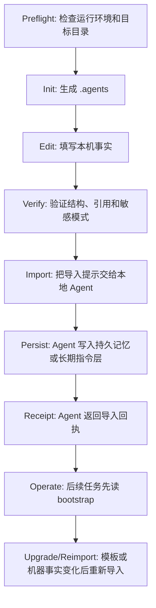

# Agent Memory Workflow

[简体中文](README.md) | [English](README.en.md)


Agent Memory Workflow 是一个本地优先的 Agent 记忆文件协议。它把本地机器上需要长期复用的 Agent 工作上下文整理为一组可审查、可验证、可迁移的 Markdown 和 JSON 文件，并提供初始化、升级、诊断和验证工具，让不同本地 Agent 能以同一套方式读取、导入和维护这些信息。

本项目解决的问题很明确：Agent 不应该每次新对话都重新扫描整台机器，也不应该把机器事实锁死在某一个产品的私有记忆里。共享事实应当存放在用户控制的本地目录中，能被人审查，能被脚本验证，能被新 Agent 可靠导入，并且不能混入凭据或私人会话数据。

默认共享目录是：

```text
$HOME\.agents
```

推荐新用户先运行只读预检，再初始化：

```powershell
npx -y github:s1oopX/agent-memory-workflow preflight --target "$HOME\.agents"
npx -y github:s1oopX/agent-memory-workflow init --target "$HOME\.agents"
npx -y github:s1oopX/agent-memory-workflow verify --root "$HOME\.agents"
```

如果需要严格复现某个已发布版本，请在 GitHub Releases 中选择固定 tag，例如：

```powershell
npx -y github:s1oopX/agent-memory-workflow#v0.1.17 --version
```

## 目录

- [项目定位](#项目定位)
- [适合场景](#适合场景)
- [不适合场景](#不适合场景)
- [工作流总览](#工作流总览)
- [一分钟开始](#一分钟开始)
- [安装方式](#安装方式)
- [初始化后的必填内容](#初始化后的必填内容)
- [让本地 Agent 导入长期记忆](#让本地-agent-导入长期记忆)
- [成功导入的判定标准](#成功导入的判定标准)
- [目录结构](#目录结构)
- [核心文件](#核心文件)
- [命令参考](#命令参考)
- [PowerShell 脚本参数](#powershell-脚本参数)
- [JSON 输出与自动化](#json-输出与自动化)
- [升级与备份语义](#升级与备份语义)
- [验证器检查内容](#验证器检查内容)
- [安全边界](#安全边界)
- [维护策略](#维护策略)
- [质量保障](#质量保障)
- [复现承诺](#复现承诺)
- [设计取舍](#设计取舍)
- [常见问题](#常见问题)
- [开发者指南](#开发者指南)
- [路线图](#路线图)
- [贡献](#贡献)
- [许可证](#许可证)

## 项目定位

编程 Agent 在真实设备上工作时，经常需要知道同一批长期事实：

- 哪些 shell、语言运行时、包管理器和构建工具可用。
- 哪些命令只在特定 shell 或 profile 中可用。
- 哪些目录是长期配置目录，哪些只是临时工作区。
- 哪些服务不应该开机自启。
- 哪些配置目录属于 live application data，不能随意移动或清理。
- 新 Agent 接入这台机器时，应该先读什么，怎样证明它真的导入了这些规则。

如果这些事实只留在单次对话里，它们会在下一次会话中丢失。如果它们只写进某个 Agent 的私有记忆，其他本地 Agent 无法可靠复用，也很难审查和迁移。

Agent Memory Workflow 的定位是提供一个本地可信源：

```text
用户机器上的 .agents 目录
        ↓
AGENT_BOOTSTRAP.md 稳定入口
        ↓
AGENT_MEMORY_IMPORT_PROMPT.md 导入协议
        ↓
Agent 写入自己的持久记忆或长期指令层
        ↓
AGENT_MEMORY_IMPORT_RECEIPT_TEMPLATE.md 回执证明
```

它不是云端记忆服务，不是数据库，不是凭据管理器，也不是某个 Agent 产品的私有插件。它是一套以文件为核心的本地协议和工具链。

## 适合场景

本项目适合这些使用者：

- 使用 Codex 类本地编程 Agent 的用户。
- 使用本地 IDE Agent、CLI Agent 或桌面 Agent 的用户。
- 需要让多个本地 Agent 共享同一台机器的工具链和路径约定的用户。
- 希望 Agent 不再重复环境自检，而是读取一个经过维护的机器事实库的用户。
- 希望把 Agent 长期记忆做成可审查、可备份、可迁移文件的用户。
- 希望开源一套可复现的本地 Agent 记忆工作流，而不是发布私人机器事实的维护者。

典型例子：

| 场景 | 价值 |
| --- | --- |
| 新开一个本地 Agent 对话 | 直接读取 bootstrap，不再从零扫描设备 |
| 更换 Agent 产品 | 仍可复用 `.agents` 中的机器事实和维护策略 |
| 更新工具链 | 修改 machine 文件后让 Agent 重新导入 |
| 整理用户目录或配置目录 | Agent 能先读维护策略，避免误删 live data |
| 开源自己的工作流 | 发布通用模板和工具，不暴露私人路径或凭据 |

## 不适合场景

本项目不试图解决这些问题：

- 远程 Web Agent 没有本地文件访问能力时的附件流程。
- 多设备同步和冲突合并。
- 云端托管记忆。
- 加密密钥库或凭据管理。
- 多用户权限系统。
- Agent 执行沙箱。
- 自动发现和审计整台机器的所有软件。

如果你的 Agent 无法读取本地文件系统，它不能直接完成这个工作流的导入。这个项目只面向本地 Agent。

## 工作流总览



每一步都有明确的输入、输出和通过条件：

| 阶段 | 命令或文件 | 通过条件 |
| --- | --- | --- |
| 预检 | `preflight` | `Result: PASS`，目标目录状态清楚 |
| 初始化 | `init` | `.agents` 目录生成，自动验证通过 |
| 填写事实 | `machine/*.md` | 只记录稳定、非敏感事实 |
| 验证 | `verify` | 必需文件、引用、版本、manifest 和常见敏感模式通过检查 |
| 导入 | `import-prompt` 或 `AGENT_MEMORY_IMPORT_PROMPT.md` | Agent 读取规定文件 |
| 持久化 | Agent 自身能力 | 记忆写入能跨新会话或进程重启保留的位置 |
| 回执 | `AGENT_MEMORY_IMPORT_RECEIPT_TEMPLATE.md` | 明确说明读了什么、写到哪里、是否持久 |
| 维护 | `status`、`doctor`、`upgrade` | 目录可诊断、可升级、可重新导入 |

## 一分钟开始

前提：

- Windows 本地环境。
- 已安装 Git。
- 已安装 PowerShell 7，并且 `pwsh` 在 PATH 中。
- 如果使用 `npx`，需要 Node.js 18 或更高版本。

推荐流程：

```powershell
npx -y github:s1oopX/agent-memory-workflow preflight --target "$HOME\.agents"
npx -y github:s1oopX/agent-memory-workflow init --target "$HOME\.agents"
npx -y github:s1oopX/agent-memory-workflow verify --root "$HOME\.agents"
npx -y github:s1oopX/agent-memory-workflow import-prompt --root "$HOME\.agents"
```

把最后一条命令输出的导入指令交给新的本地 Agent。Agent 完成后应返回导入回执。

## 安装方式

### 方式一：通过 npx 从 GitHub 运行

适合普通使用者。无需全局安装 npm 包：

```powershell
npx -y github:s1oopX/agent-memory-workflow preflight --target "$HOME\.agents"
npx -y github:s1oopX/agent-memory-workflow init --target "$HOME\.agents"
```

验证：

```powershell
npx -y github:s1oopX/agent-memory-workflow verify --root "$HOME\.agents"
```

诊断：

```powershell
npx -y github:s1oopX/agent-memory-workflow doctor --root "$HOME\.agents"
```

### 方式二：克隆仓库后运行 PowerShell 脚本

适合贡献者、审查者和需要离线查看模板的人：

```powershell
git clone https://github.com/s1oopX/agent-memory-workflow.git
cd agent-memory-workflow
pwsh -NoProfile -ExecutionPolicy Bypass -File .\tools\init-agent-memory-workflow.ps1 -TargetRoot "$HOME\.agents"
```

验证生成目录：

```powershell
pwsh -NoProfile -ExecutionPolicy Bypass -File "$HOME\.agents\tools\verify-agent-memory-workflow.ps1" -Root "$HOME\.agents"
```

验证仓库模板：

```powershell
npm run verify
```

### 方式三：固定 release tag 复现

适合教程、自动化脚本和可审计环境：

```powershell
npx -y github:s1oopX/agent-memory-workflow#v0.1.17 preflight --target "$HOME\.agents"
npx -y github:s1oopX/agent-memory-workflow#v0.1.17 init --target "$HOME\.agents"
```

固定 tag 能避免默认分支变化影响你的脚本。正式环境建议固定 tag。

## 初始化后的必填内容

初始化只会生成通用模板。真正有价值的机器事实需要由用户或可信本地 Agent 填写。

优先编辑：

```text
$HOME\.agents\machine\MACHINE_ENVIRONMENT_MEMORY.md
$HOME\.agents\machine\AGENT_ENVIRONMENT_QUICK_REFERENCE.md
$HOME\.agents\machine\HOME_DIRECTORY_MAP.md
$HOME\.agents\machine\MAINTENANCE_POLICY.md
```

建议记录：

- 已验证可用的 shell、语言运行时、包管理器、数据库客户端和构建工具。
- 已验证不可用或不在 PATH 的工具。
- 特定 shell 中才成立的差异，例如 PowerShell、CMD、Git Bash、Developer PowerShell。
- 长期有效路径，例如代码目录、Agent 目录、用户配置目录。
- 临时路径或可删除目录的边界。
- 本地服务策略，例如 Docker 是否不应开机自启。
- 维护 `.agents`、`.codex`、IDE 配置目录等 live data 的规则。

不要记录：

- 密码。
- API token。
- 私钥。
- Cookie。
- 数据库凭据。
- Redis、MySQL 等服务密钥。
- 私人聊天记录。
- 临时会话日志。

## 让本地 Agent 导入长期记忆

给本地 Agent 的最小指令是：

```text
Read $HOME\.agents\AGENT_MEMORY_IMPORT_PROMPT.md and import it into your local durable memory or persistent instruction layer.
```

也可以由 CLI 生成：

```powershell
npx -y github:s1oopX/agent-memory-workflow import-prompt --root "$HOME\.agents"
```

Agent 必须按照导入提示读取规定文件，而不是只读 README。核心读取顺序由 `AGENT_MEMORY_IMPORT_PROMPT.md` 定义，通常包括：

```text
AGENT_BOOTSTRAP.md
machine\MACHINE_ENVIRONMENT_MEMORY.md
machine\AGENT_EXECUTION_PLAYBOOK.md
machine\AGENT_ENVIRONMENT_QUICK_REFERENCE.md
machine\HOME_DIRECTORY_MAP.md
machine\MAINTENANCE_POLICY.md
AGENT_MEMORY_IMPORT_RECEIPT_TEMPLATE.md
AGENT_PLATFORM_ADAPTERS.md
imports\IMPORT_REGISTRY.md
```

Agent 应持久化的是紧凑指针和稳定事实，而不是把所有源文件全文复制进记忆。最低持久记录应包含：

```text
Agent Memory Workflow root: $HOME\.agents
Bootstrap: $HOME\.agents\AGENT_BOOTSTRAP.md
Machine facts: $HOME\.agents\machine
Verifier: $HOME\.agents\tools\verify-agent-memory-workflow.ps1
Scope: local filesystem agents only
Secrets policy: never store credentials, tokens, private keys, cookies, service secrets, or database passwords
Default behavior: use the bootstrap path as the first machine-context source; do not re-audit the whole environment for ordinary tasks
```

## 成功导入的判定标准

Agent 不能只说“我已记住”。它必须基于以下模板返回回执：

```text
$HOME\.agents\AGENT_MEMORY_IMPORT_RECEIPT_TEMPLATE.md
```

合格回执至少说明：

- 实际读取了哪些文件。
- 是否拥有本地文件系统访问能力。
- 持久记录写入到了哪里。
- 该位置是否能跨新对话或进程重启保留。
- 是否只写入了项目规则、用户记忆、启动指令或当前聊天。
- 是否仍需要用户手动操作。
- 是否需要新会话验证。
- 是否遵守不写入敏感信息的策略。

如果 Agent 只能在当前聊天中暂存这些信息，回执必须标记为 `chat_local_only`。如果 Agent 需要用户手动把内容放入设置页或记忆页，回执必须标记为 `manual_user_action_required`。

## 目录结构

仓库结构：

```text
agent-memory-workflow/
  bin/
    agent-memory-workflow.js
  tools/
    init-agent-memory-workflow.ps1
    test-agent-memory-workflow.ps1
    verify-agent-memory-workflow.ps1
  templates/
    AGENT_BOOTSTRAP.md
    AGENT_MEMORY_IMPORT_PROMPT.md
    AGENT_MEMORY_IMPORT_RECEIPT_TEMPLATE.md
    AGENT_MEMORY_WORKFLOW.md
    AGENT_MEMORY_WORKFLOW_CHANGELOG.md
    AGENT_MEMORY_WORKFLOW_MANIFEST.json
    AGENT_PLATFORM_ADAPTERS.md
    AGENT_WORKFLOW_OPEN_SOURCE_GUIDE.md
    AGENT_WORKFLOW_REPLICATION_STRATEGY.md
    AGENTS.md
    README.md
    imports/
      README.md
      IMPORT_REGISTRY.md
    machine/
      MACHINE_ENVIRONMENT_MEMORY.md
      AGENT_EXECUTION_PLAYBOOK.md
      AGENT_ENVIRONMENT_QUICK_REFERENCE.md
      HOME_DIRECTORY_MAP.md
      MAINTENANCE_POLICY.md
```

安装后的目标目录结构：

```text
$HOME\.agents\
  AGENT_BOOTSTRAP.md
  AGENT_MEMORY_IMPORT_PROMPT.md
  AGENT_MEMORY_IMPORT_RECEIPT_TEMPLATE.md
  AGENT_MEMORY_WORKFLOW.md
  AGENT_MEMORY_WORKFLOW_CHANGELOG.md
  AGENT_MEMORY_WORKFLOW_MANIFEST.json
  AGENT_PLATFORM_ADAPTERS.md
  AGENT_WORKFLOW_OPEN_SOURCE_GUIDE.md
  AGENT_WORKFLOW_REPLICATION_STRATEGY.md
  AGENTS.md
  README.md
  imports\
    README.md
    IMPORT_REGISTRY.md
  machine\
    MACHINE_ENVIRONMENT_MEMORY.md
    AGENT_EXECUTION_PLAYBOOK.md
    AGENT_ENVIRONMENT_QUICK_REFERENCE.md
    HOME_DIRECTORY_MAP.md
    MAINTENANCE_POLICY.md
  tools\
    init-agent-memory-workflow.ps1
    verify-agent-memory-workflow.ps1
```

初始化脚本会把 `templates/` 中的文件复制到目标目录，并替换路径、用户名、系统名称和生成时间等占位符。

## 核心文件

| 文件 | 角色 | 维护者 |
| --- | --- | --- |
| `AGENT_BOOTSTRAP.md` | Agent 的稳定入口，后续任务优先读取这里 | 模板维护者 |
| `AGENT_MEMORY_IMPORT_PROMPT.md` | 新 Agent 导入长期记忆时必须遵循的指令 | 模板维护者 |
| `AGENT_MEMORY_IMPORT_RECEIPT_TEMPLATE.md` | Agent 完成导入后返回的回执格式 | 模板维护者 |
| `AGENT_MEMORY_WORKFLOW.md` | 工作流摘要、版本和重导入规则 | 模板维护者 |
| `AGENT_MEMORY_WORKFLOW_MANIFEST.json` | 机器可读路径、版本和策略清单 | 初始化脚本生成 |
| `AGENT_PLATFORM_ADAPTERS.md` | 本地 Codex、IDE、CLI、桌面 Agent 的适配规则 | 模板维护者 |
| `AGENT_WORKFLOW_REPLICATION_STRATEGY.md` | 文件协议、CLI、Skill、SDK 的取舍说明 | 模板维护者 |
| `AGENT_WORKFLOW_OPEN_SOURCE_GUIDE.md` | 开源边界、发布清单和复现标准 | 模板维护者 |
| `imports/IMPORT_REGISTRY.md` | 记录哪些 Agent 已导入、是否需要重新导入 | 用户或本地 Agent |
| `machine/MACHINE_ENVIRONMENT_MEMORY.md` | 完整机器事实库 | 用户或可信本地 Agent |
| `machine/AGENT_ENVIRONMENT_QUICK_REFERENCE.md` | 给 Agent 快速读取的摘要 | 用户或可信本地 Agent |
| `machine/AGENT_EXECUTION_PLAYBOOK.md` | 这台机器上的命令执行策略 | 用户或可信本地 Agent |
| `machine/HOME_DIRECTORY_MAP.md` | 用户目录和常见路径说明 | 用户或可信本地 Agent |
| `machine/MAINTENANCE_POLICY.md` | 清理、移动、删除、发布前的维护约束 | 用户或可信本地 Agent |

## 命令参考

所有 `npx` 命令都可以加 `-y` 避免交互确认。

| 命令 | 写入文件 | 用途 |
| --- | --- | --- |
| `preflight` | 否 | 初始化前检查 `pwsh`、打包源文件和目标目录状态 |
| `init` | 是 | 生成新的 `.agents` 目录 |
| `init --dry-run` | 否 | 预览初始化会创建、覆盖或失败的文件 |
| `upgrade` | 是 | 安全刷新已有目录中的工作流托管文件 |
| `verify` | 否 | 验证目标目录结构、引用、版本、manifest 和敏感模式 |
| `status` | 否 | 查看轻量安装状态 |
| `show-paths` | 否 | 输出 bootstrap、manifest、machine、verifier 等关键路径 |
| `import-prompt` | 否 | 输出可直接交给本地 Agent 的导入指令 |
| `doctor` | 否 | 检查运行时和目标目录，并调用验证器 |
| `--version` | 否 | 输出 CLI 版本 |

### 预检

```powershell
npx -y github:s1oopX/agent-memory-workflow preflight --target "$HOME\.agents"
npx -y github:s1oopX/agent-memory-workflow preflight --target "$HOME\.agents" --json
```

`preflight` 会报告：

- CLI 版本。
- Node 版本。
- PowerShell 7 是否可用。
- 仓库打包源是否存在。
- 目标目录是否存在。
- 目标目录是 fresh install、existing workflow 还是 existing non-workflow directory。
- 非工作流目录中是否已有会阻止普通初始化的工作流托管文件。

### 初始化

```powershell
npx -y github:s1oopX/agent-memory-workflow init --target "$HOME\.agents"
```

预览，不写入文件：

```powershell
npx -y github:s1oopX/agent-memory-workflow init --target "$HOME\.agents" --dry-run
```

如果 dry run 发现目标文件已存在且未传入 `--force`，命令会输出 `Result: FAIL` 并以非零状态退出，但仍不会写入文件。

### 升级

```powershell
npx -y github:s1oopX/agent-memory-workflow upgrade --target "$HOME\.agents"
```

`upgrade` 是安全升级模式，等价于带强制刷新语义的初始化。它会覆盖工作流托管文件、创建备份，并默认保留 `machine\` 下已有的机器事实。

### 验证

```powershell
npx -y github:s1oopX/agent-memory-workflow verify --root "$HOME\.agents"
npx -y github:s1oopX/agent-memory-workflow verify --root "$HOME\.agents" --json
```

### 状态

```powershell
npx -y github:s1oopX/agent-memory-workflow status --root "$HOME\.agents"
npx -y github:s1oopX/agent-memory-workflow status --root "$HOME\.agents" --json
```

### 路径输出

```powershell
npx -y github:s1oopX/agent-memory-workflow show-paths --root "$HOME\.agents"
npx -y github:s1oopX/agent-memory-workflow show-paths --root "$HOME\.agents" --json
```

### 导入提示

```powershell
npx -y github:s1oopX/agent-memory-workflow import-prompt --root "$HOME\.agents"
npx -y github:s1oopX/agent-memory-workflow import-prompt --root "$HOME\.agents" --json
```

### 诊断

```powershell
npx -y github:s1oopX/agent-memory-workflow doctor --root "$HOME\.agents"
npx -y github:s1oopX/agent-memory-workflow doctor --root "$HOME\.agents" --json
```

## PowerShell 脚本参数

直接运行初始化脚本时可用：

```powershell
pwsh -NoProfile -ExecutionPolicy Bypass -File .\tools\init-agent-memory-workflow.ps1 `
  -TargetRoot "$HOME\.agents"
```

常用参数：

| 参数 | 含义 |
| --- | --- |
| `-TargetRoot <path>` | 目标 `.agents` 目录 |
| `-SourceRoot <path>` | 模板源目录所在仓库根目录，通常不需要手动传 |
| `-Force` | 允许覆盖已存在的工作流托管文件 |
| `-DryRun` | 只预览，不写入 |
| `-BackupRoot <path>` | 指定备份目录 |
| `-NoBackup` | 覆盖时不备份，只建议临时测试目录使用 |
| `-OverwriteMachineFacts` | 明确允许覆盖 `machine\` 下已有机器事实 |
| `-SkipVerify` | 初始化后跳过自动验证 |

直接运行验证器：

```powershell
pwsh -NoProfile -ExecutionPolicy Bypass -File "$HOME\.agents\tools\verify-agent-memory-workflow.ps1" -Root "$HOME\.agents"
pwsh -NoProfile -ExecutionPolicy Bypass -File "$HOME\.agents\tools\verify-agent-memory-workflow.ps1" -Root "$HOME\.agents" -Json
```

## JSON 输出与自动化

以下命令支持 `--json`：

```text
preflight
verify
status
show-paths
import-prompt
doctor
```

JSON 输出用于脚本、CI、编辑器集成和 Agent 自动化。约定：

- `ok: true` 表示检查通过。
- `ok: false` 表示存在失败项。
- 失败时命令以非零状态退出。
- `failures` 数组给出可执行的失败原因。

示例：

```powershell
npx -y github:s1oopX/agent-memory-workflow doctor --root "$HOME\.agents" --json
```

适合自动化读取的字段包括：

- `cli_version`
- `powershell.status`
- `target.mode`
- `manifest.version`
- `paths.bootstrap`
- `paths.import_prompt`
- `failures`

## 升级与备份语义

默认安全规则：

- 普通 `init` 不会覆盖已有文件。
- `init --dry-run` 不写入任何文件。
- `upgrade` 会刷新工作流托管文件。
- 覆盖前默认创建备份。
- `machine\` 下已有机器事实默认保留。
- 只有显式传入 `--overwrite-machine-facts` 或 `-OverwriteMachineFacts` 才会覆盖机器事实。
- `--no-backup` 或 `-NoBackup` 会关闭备份保护，只建议用于可丢弃测试目录。

推荐升级流程：

```powershell
npx -y github:s1oopX/agent-memory-workflow init --target "$HOME\.agents" --dry-run --force
npx -y github:s1oopX/agent-memory-workflow upgrade --target "$HOME\.agents"
npx -y github:s1oopX/agent-memory-workflow verify --root "$HOME\.agents"
```

升级后如果导入提示、manifest、平台适配或机器事实发生实质变化，应要求已接入的 Agent 重新导入。

## 验证器检查内容

`verify-agent-memory-workflow.ps1` 会检查：

- 必需文件是否存在。
- `workflow-v3` 版本标记是否完整。
- 核心文档之间的引用是否完整。
- 回执模板是否包含必需字段。
- Manifest 是否能解析为 JSON。
- Manifest 中的路径是否指向当前目标目录。
- Manifest 的 adapter 分类是否保持 local-only 范围。
- Manifest 的复制策略和开源策略字段是否存在。
- 常见敏感信息模式是否出现在共享文件中。

验证器不能替代人工审查。发布、提交、复制或交给 Agent 导入前，仍应人工确认没有凭据、私人路径策略、私人导入回执或临时会话日志。

## 安全边界

可以写入共享记忆：

- 工具名称和版本。
- PATH 或 shell 的非敏感行为差异。
- 稳定目录位置。
- 本地服务启动偏好。
- 构建工具可用性。
- Agent 执行策略。
- 本地目录维护规则。
- 已知风险项和处理策略。

不能写入共享记忆：

- 密码。
- API token。
- 私钥。
- Cookie。
- 数据库凭据。
- Redis、MySQL 等服务密钥。
- 私人聊天记录。
- 临时会话日志。
- 未经用户确认的私人组织信息。

如果某个任务需要凭据，应使用用户批准的本地凭据机制，或在当前任务中向用户请求。不要把凭据写入 `.agents`。

## 维护策略

建议在以下情况运行验证器：

- 修改 `machine/` 下的机器事实后。
- 修改导入提示或回执模板后。
- 修改 manifest 后。
- 修改初始化脚本、验证脚本或 CLI 后。
- 准备提交、发布或迁移到新机器前。

建议在以下情况要求 Agent 重新导入：

- 工作流版本变化。
- `AGENT_MEMORY_IMPORT_PROMPT.md` 变化。
- `AGENT_MEMORY_WORKFLOW_MANIFEST.json` 变化。
- `AGENT_PLATFORM_ADAPTERS.md` 变化。
- `machine/` 下的事实发生实质变化。
- 验证器规则变化。

维护 `.agents` 目录时的原则：

- 先验证，再导入。
- 先 dry run，再 upgrade。
- 先备份，再覆盖。
- 机器事实默认保留。
- 敏感信息宁可不写，也不要依赖后续清理。

## 质量保障

仓库提供本地 CI：

```powershell
npm run ci
```

它会运行：

```text
node --check ./bin/agent-memory-workflow.js
pwsh ... verify-agent-memory-workflow.ps1 -Root ./templates -TemplateMode
pwsh ... test-agent-memory-workflow.ps1
npm pack --dry-run
```

覆盖的关键行为包括：

- 新目录初始化。
- dry run 成功和冲突失败。
- 非工作流目标目录中的托管文件冲突检测。
- `--force` 默认保留机器事实。
- 显式覆盖机器事实。
- `upgrade` 安全刷新。
- `verify --json`。
- `status --json`。
- `show-paths --json`。
- `import-prompt --json`。
- `doctor --json`。
- 未知参数拒绝。
- npm 包内容预检。

## 复现承诺

公开仓库发布的是：

- 协议文档。
- 通用模板。
- 初始化脚本。
- 验证脚本。
- Node CLI 包装器。
- 测试和 CI 配置。

公开仓库不发布：

- 某台私人机器的 `.agents` 实例。
- 私人路径策略。
- 私人导入回执。
- 凭据或服务密钥。
- 临时会话日志。

一个新用户应能在不了解原始作者机器的情况下完成：

1. 克隆仓库或通过 `npx` 调用。
2. 运行 `preflight`。
3. 运行 `init`。
4. 填写自己的机器事实。
5. 运行 `verify`。
6. 把导入提示交给本地 Agent。
7. 收到结构化导入回执。

## 设计取舍

### 为什么是文件协议

文件协议有几个现实优势：

- Markdown 和 JSON 可直接审查。
- 不需要数据库服务。
- 不依赖特定 Agent 产品。
- 便于备份、diff、回滚和迁移。
- Agent 可以用普通文件读取能力接入。
- 人类可以直接修正错误事实。

### 为什么不是数据库

数据库适合并发写入、复杂查询和多设备同步，但会引入部署、备份、权限和审查成本。当前目标是让本地 Agent 可靠获得机器级上下文，文件协议足够直接。

### 为什么不是 SDK

SDK 适合稳定应用边界已经出现之后。当前阶段更重要的是先稳定协议、模板、验证器和 CLI 行为。未来如果多个本地工具需要程序化读写同一套状态，再引入 SDK 会更自然。

### 为什么不是只写一个 Prompt

单个 Prompt 很容易失去来源、版本、验证和维护边界。这个项目把 Prompt 放在文件协议中，并要求：

- 有 bootstrap。
- 有 manifest。
- 有验证器。
- 有导入回执。
- 有重导入规则。
- 有安全边界。
- 有升级和备份语义。

## 常见问题

### 这个项目会让所有 Agent 自动拥有长期记忆吗

不会。它提供本地可信源和导入协议。是否能写入长期记忆，取决于具体 Agent 是否提供持久记忆、规则、配置或启动指令层。

### 如果 Agent 只能当前对话记住怎么办

它必须在回执中标记 `chat_local_only`，不能声称已经完成长期导入。

### `.agents` 应该放在哪里

默认是 `$HOME\.agents`。这是用户级、长期、可审查的位置。也可以通过 `--target` 指定其他目录。

### 能不能把真实机器事实提交到这个仓库

不要。公共仓库只应提交通用模板和工具。真实机器事实属于使用者本地实例。

### Docker、数据库或服务启动偏好能不能记录

可以记录非敏感策略，例如“Docker 不应开机自启”。不能记录密码、token、连接密钥或私人服务细节。

### 什么时候使用 `upgrade`

当模板、导入协议、验证器或 CLI 有新版本，并且你想刷新已有 `.agents` 目录时使用。升级前建议先 dry run。

### `preflight` 和 `verify` 有什么区别

`preflight` 在初始化前运行，检查运行时、打包源和目标目录状态。`verify` 在目录存在后运行，检查已安装工作流的结构、引用、manifest 和常见风险。

### 新 Agent 是否应该每次都重新做全环境扫描

不应该。普通任务应先读取 bootstrap 和 machine 文件。只有用户要求重新审计，或机器事实明显过期时，才需要重新做环境扫描。

## 开发者指南

本地开发：

```powershell
git clone https://github.com/s1oopX/agent-memory-workflow.git
cd agent-memory-workflow
npm run ci
```

单项检查：

```powershell
npm run check
npm run verify
npm test
npm run pack:dry-run
```

修改行为时应同步：

- `bin/agent-memory-workflow.js`
- `tools/init-agent-memory-workflow.ps1`
- `tools/verify-agent-memory-workflow.ps1`
- `tools/test-agent-memory-workflow.ps1`
- `templates/`
- `README.md`
- `README.en.md`
- `CHANGELOG.md`

发布前检查：

```powershell
npm run ci
npx -y github:s1oopX/agent-memory-workflow#<tag> --version
```

安全敏感变更还应人工审查模板中是否出现私人路径、凭据或服务密钥。

## 路线图

短期：

- 继续增强预检和诊断输出。
- 改善验证器失败信息。
- 完善本地 Agent 适配示例。
- 增强文档中的故障排查路径。

中期：

- 为更多本地 Agent 类型补充 adapter 指南。
- 引入更严格的 manifest/source 文件一致性检查。
- 增加版本迁移辅助。
- 改进机器可读输出稳定性。

长期：

- 在协议稳定后评估轻量 SDK。
- 支持更完整的本地导入审计。
- 为多 Agent 本地协作提供更清晰的状态模型。

## 贡献

欢迎提交 Issue 和 Pull Request。适合贡献的方向包括：

- 改进文档表达和示例。
- 增加本地 Agent 适配说明。
- 改进 PowerShell 初始化和验证脚本。
- 增强安全扫描规则。
- 提供跨平台路径处理改进。
- 改进 CLI JSON 输出和自动化体验。

提交贡献前请运行：

```powershell
npm run ci
```

完整贡献流程见 [CONTRIBUTING.md](CONTRIBUTING.md)。安全敏感问题请按 [SECURITY.md](SECURITY.md) 处理，不要在公开 Issue 中披露凭据、私有机器事实或私人路径策略。

## 许可证

本项目基于 MIT License 发布。详见 [LICENSE](LICENSE)。
