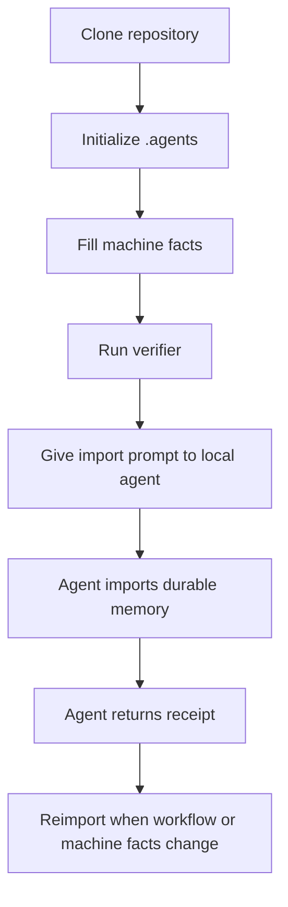

# Agent Memory Workflow

[简体中文](README.md) | [English](README.en.md)


Agent Memory Workflow 是一个本地优先的 Agent 记忆文件协议。它用于把“这台机器上 Agent 应该长期知道的事实”整理成可审查、可验证、可迁移的本地文件，让不同本地 Agent 能够共享同一套机器级指导信息，而不依赖云端记忆服务或某个特定 Agent 产品。

本项目的目标不是替代 Agent 自身的记忆系统，而是提供一个稳定的本地可信源：Agent 读取这个可信源，将稳定事实导入自己的持久记忆或长期指令层，并用回执证明导入结果。

## 目录

- [项目定位](#项目定位)
- [适用范围](#适用范围)
- [当前状态](#当前状态)
- [核心概念](#核心概念)
- [工作方式](#工作方式)
- [环境要求](#环境要求)
- [快速开始](#快速开始)
- [初始化后需要编辑的文件](#初始化后需要编辑的文件)
- [让新 Agent 导入记忆](#让新-agent-导入记忆)
- [目录结构](#目录结构)
- [协议文件说明](#协议文件说明)
- [命令参考](#命令参考)
- [验证器检查内容](#验证器检查内容)
- [安全边界](#安全边界)
- [维护策略](#维护策略)
- [设计原则](#设计原则)
- [为什么不是数据库或 SDK](#为什么不是数据库或-sdk)
- [发布与复现承诺](#发布与复现承诺)
- [路线图](#路线图)
- [贡献](#贡献)
- [许可证](#许可证)

## 项目定位

编程 Agent 在真实设备上工作时，经常需要重复识别同一批信息：

- 哪些工具可用，哪些工具不可用
- 哪些路径是长期有效路径，哪些只是临时工作目录
- 哪些服务不应开机自启
- 哪些环境变量、PATH 或 shell 行为存在差异
- 哪些配置目录不能随意清理
- 新 Agent 应如何读取并继承这些机器级约定

如果这些事实只存在于单次对话中，它们很快会丢失。如果把它们直接写进某个 Agent 的私有记忆，又很难复用到其他本地 Agent。

Agent Memory Workflow 采用更稳妥的方式：把共享事实保存在本地 `.agents` 目录中，并要求每个 Agent 按同一套导入协议读取、持久化和回执。

## 适用范围

本项目适用于：

- 本地 Codex 类 Agent
- 本地 IDE Agent
- 本地 CLI Agent
- 本地桌面 Agent
- 能够读取本地文件系统的其他编程 Agent

本项目不提供：

- 云端同步
- 托管式记忆数据库
- 远程 Web Agent 附件流程
- 凭据管理
- 多设备状态同步
- Agent 执行沙箱

唯一可信源始终是使用者本机的 `.agents` 目录。

## 当前状态

| 项目 | 状态 |
| --- | --- |
| 工作流版本 | `workflow-v3` |
| 安装入口 | PowerShell 7 脚本 |
| CLI 包装器 | `npx github:s1oopX/agent-memory-workflow` |
| 模板源 | `templates/` |
| 验证器 | `tools/verify-agent-memory-workflow.ps1` |
| 自动验证 | GitHub Actions + `npm run ci` |
| 默认平台 | Windows 本地 Agent 场景 |
| 许可证 | MIT |

## 核心概念

| 概念 | 说明 |
| --- | --- |
| `.agents` | 使用者机器上的本地共享记忆目录 |
| Bootstrap | Agent 读取本地记忆时的稳定入口文件 |
| Import Prompt | 要交给新 Agent 的导入指令 |
| Receipt | Agent 完成导入后返回的结构化回执 |
| Machine Facts | 关于当前机器的非敏感、长期有效事实 |
| Manifest | 描述当前工作流版本、路径和策略的机器可读清单 |
| Verifier | 检查目录结构、版本标记、引用关系和常见敏感模式的验证脚本 |

## 工作方式



流程要点：

1. 用户生成自己的 `.agents` 目录。
2. 用户或可信本地 Agent 填写机器事实。
3. 验证器确认结构和策略一致。
4. 新 Agent 读取导入提示。
5. Agent 将稳定事实写入自身持久层。
6. Agent 返回导入回执。
7. 工作流或机器事实变化后重新导入。

## 环境要求

必需：

- Git
- PowerShell 7 或更高版本，并可通过 `pwsh` 调用
- 能够读取本地文件系统的 Agent

可选：

- Node.js 18 或更高版本，用于 `npx` 包装器

当前发布版以 PowerShell 7 作为初始化和验证入口，并已面向 Windows 本地 Agent 工作流验证。

## 快速开始

### 方式一：克隆仓库后初始化

```powershell
git clone https://github.com/s1oopX/agent-memory-workflow.git
cd agent-memory-workflow
pwsh -NoProfile -ExecutionPolicy Bypass -File .\tools\init-agent-memory-workflow.ps1 -TargetRoot "$HOME\.agents"
```

验证生成后的目录：

```powershell
pwsh -NoProfile -ExecutionPolicy Bypass -File "$HOME\.agents\tools\verify-agent-memory-workflow.ps1"
```

### 方式二：通过 npx 从 GitHub 运行

```powershell
npx github:s1oopX/agent-memory-workflow init --target "$HOME\.agents"
npx github:s1oopX/agent-memory-workflow verify --root "$HOME\.agents"
```

`npx` 包装器只负责调用仓库内的 PowerShell 脚本，不会把 Markdown 文件隐藏到私有数据库中。

## 初始化后需要编辑的文件

初始化完成后，优先编辑以下文件：

```text
$HOME\.agents\machine\MACHINE_ENVIRONMENT_MEMORY.md
$HOME\.agents\machine\AGENT_ENVIRONMENT_QUICK_REFERENCE.md
$HOME\.agents\machine\HOME_DIRECTORY_MAP.md
```

这些文件应记录稳定、非敏感的机器事实，例如：

- 已验证可用的 shell、语言运行时、包管理器和构建工具
- 长期有效的代码目录、配置目录和 Agent 目录
- 工具链差异，例如某些命令只在特定 shell 中可用
- 本地服务偏好，例如某个服务是否不应开机自启
- Agent 维护本目录时需要遵守的策略

不要记录密码、令牌、私钥、Cookie、数据库凭据或私人会话日志。

## 让新 Agent 导入记忆

向本地 Agent 提供以下指令：

```text
Read $HOME\.agents\AGENT_MEMORY_IMPORT_PROMPT.md and import it into your local durable memory or persistent instruction layer.
```

Agent 完成后应基于以下模板返回回执：

```text
$HOME\.agents\AGENT_MEMORY_IMPORT_RECEIPT_TEMPLATE.md
```

回执必须说明：

- 读取了哪些文件
- 是否拥有本地文件访问能力
- 记忆写入到了哪里
- 写入是否持久
- 是否仍需要用户手动操作
- 是否需要新会话验证
- 是否遵守不写入敏感信息的策略

如果 Agent 只能在当前对话中记住这些信息，回执应标记为 `chat_local_only`，不能声称已经写入长期记忆。

## 目录结构

```text
agent-memory-workflow/
  bin/
    agent-memory-workflow.js
  tools/
    init-agent-memory-workflow.ps1
    verify-agent-memory-workflow.ps1
  templates/
    AGENT_BOOTSTRAP.md
    AGENT_MEMORY_IMPORT_PROMPT.md
    AGENT_MEMORY_IMPORT_RECEIPT_TEMPLATE.md
    AGENT_MEMORY_WORKFLOW.md
    AGENT_MEMORY_WORKFLOW_CHANGELOG.md
    AGENT_MEMORY_WORKFLOW_MANIFEST.json
    AGENT_PLATFORM_ADAPTERS.md
    AGENT_WORKFLOW_OPEN_SOURCE_GUIDE.md
    AGENT_WORKFLOW_REPLICATION_STRATEGY.md
    AGENTS.md
    README.md
    imports/
      README.md
      IMPORT_REGISTRY.md
    machine/
      MACHINE_ENVIRONMENT_MEMORY.md
      AGENT_EXECUTION_PLAYBOOK.md
      AGENT_ENVIRONMENT_QUICK_REFERENCE.md
      HOME_DIRECTORY_MAP.md
      MAINTENANCE_POLICY.md
```

安装到目标机器后，`templates/` 中的内容会被复制到目标 `.agents` 目录，并替换路径、用户和系统占位符。

## 协议文件说明

| 文件 | 作用 |
| --- | --- |
| `AGENT_BOOTSTRAP.md` | 本地 Agent 的稳定入口 |
| `AGENT_MEMORY_IMPORT_PROMPT.md` | 新 Agent 导入本地记忆时使用的指令 |
| `AGENT_MEMORY_IMPORT_RECEIPT_TEMPLATE.md` | Agent 导入后必须返回的回执模板 |
| `AGENT_MEMORY_WORKFLOW.md` | 工作流摘要和重导入规则 |
| `AGENT_MEMORY_WORKFLOW_MANIFEST.json` | 机器可读的版本、路径和策略清单 |
| `AGENT_PLATFORM_ADAPTERS.md` | 不同本地 Agent 类型的适配指导 |
| `AGENT_WORKFLOW_REPLICATION_STRATEGY.md` | 文件协议、CLI、Skill、SDK 的取舍说明 |
| `AGENT_WORKFLOW_OPEN_SOURCE_GUIDE.md` | 开源发布边界和检查清单 |
| `imports/IMPORT_REGISTRY.md` | 记录 Agent 导入状态 |
| `machine/*` | 当前机器的稳定、非敏感事实 |

## 命令参考

初始化：

```powershell
pwsh -NoProfile -ExecutionPolicy Bypass -File .\tools\init-agent-memory-workflow.ps1 -TargetRoot "$HOME\.agents"
```

强制覆盖目标文件：

```powershell
pwsh -NoProfile -ExecutionPolicy Bypass -File .\tools\init-agent-memory-workflow.ps1 -TargetRoot "$HOME\.agents" -Force
```

`-Force` 会自动备份被覆盖的文件，并默认保留 `machine\` 下已有的机器事实。
如确实不希望生成备份，可额外传入 `-NoBackup`；这只建议在临时测试目录中使用。

预览初始化或升级操作，不写入文件：

```powershell
pwsh -NoProfile -ExecutionPolicy Bypass -File .\tools\init-agent-memory-workflow.ps1 -TargetRoot "$HOME\.agents" -DryRun
```

指定备份目录：

```powershell
pwsh -NoProfile -ExecutionPolicy Bypass -File .\tools\init-agent-memory-workflow.ps1 -TargetRoot "$HOME\.agents" -Force -BackupRoot "$HOME\.agents-backup"
```

明确允许覆盖 `machine\` 下的机器事实：

```powershell
pwsh -NoProfile -ExecutionPolicy Bypass -File .\tools\init-agent-memory-workflow.ps1 -TargetRoot "$HOME\.agents" -Force -OverwriteMachineFacts
```

跳过初始化后的自动验证：

```powershell
pwsh -NoProfile -ExecutionPolicy Bypass -File .\tools\init-agent-memory-workflow.ps1 -TargetRoot "$HOME\.agents" -SkipVerify
```

验证目标目录：

```powershell
pwsh -NoProfile -ExecutionPolicy Bypass -File "$HOME\.agents\tools\verify-agent-memory-workflow.ps1" -Root "$HOME\.agents"
```

验证仓库模板：

```powershell
npm run verify
```

运行完整本地 CI：

```powershell
npm run ci
```

通过 Node 包装器初始化：

```powershell
npx github:s1oopX/agent-memory-workflow init --target "$HOME\.agents"
```

通过 Node 包装器预览初始化：

```powershell
npx github:s1oopX/agent-memory-workflow init --target "$HOME\.agents" --dry-run
```

通过 Node 包装器验证：

```powershell
npx github:s1oopX/agent-memory-workflow verify --root "$HOME\.agents"
```

## 验证器检查内容

`verify-agent-memory-workflow.ps1` 会检查：

- 必需文件是否存在
- `workflow-v3` 版本标记是否完整
- 核心文档之间的引用是否完整
- 回执模板是否包含必需字段
- Manifest 是否能解析为 JSON
- Manifest 中的路径是否指向当前目标目录
- Adapter 分类是否保持 local-only 范围
- 常见敏感信息模式是否出现在共享文件中

验证器不能替代人工审查。发布、共享或提交机器特定文件前，仍应人工确认没有私有事实或敏感信息。

## 安全边界

共享记忆文件可以记录：

- 工具名称和版本
- PATH 或 shell 的非敏感行为差异
- 稳定目录位置
- 本地服务启动偏好
- 构建工具可用性
- Agent 执行策略
- 本地目录维护规则

共享记忆文件不得记录：

- 密码
- API Token
- 私钥
- Cookie
- 数据库凭据
- Redis、MySQL 等服务密钥
- 私人聊天记录
- 临时会话日志

如果某个任务需要凭据，应使用用户批准的本地凭据机制，或在当前任务中向用户请求，而不是把凭据写入共享记忆。

## 维护策略

建议在以下情况重新运行验证器：

- 修改 `machine/` 下的机器事实
- 修改导入提示或回执模板
- 修改 Manifest
- 修改初始化脚本或验证脚本
- 准备提交或发布新版本

升级已有 `.agents` 目录时，建议先运行 `-DryRun`，确认将创建、覆盖或保留哪些文件。使用 `-Force` 时，脚本会备份被覆盖的文件，并默认保留 `machine\` 下已有的机器事实；只有显式传入 `-OverwriteMachineFacts` 才会覆盖这些文件。`-NoBackup` 会关闭备份保护，只应在可丢弃目录中使用。

建议在以下情况要求 Agent 重新导入：

- 工作流版本变化
- `AGENT_MEMORY_IMPORT_PROMPT.md` 变化
- `AGENT_MEMORY_WORKFLOW_MANIFEST.json` 变化
- 机器事实发生实质变化
- 平台适配策略变化

## 设计原则

- 本地优先：可信源在用户自己的文件系统中。
- 文件可审查：Markdown 和 JSON 优先，不隐藏在私有数据库中。
- Agent 中立：协议不绑定特定 Agent 产品。
- 可验证：结构、版本、引用和常见风险由脚本检查。
- 不存敏感信息：共享记忆只保存非敏感、长期有效事实。
- 可迁移：每台机器生成自己的实例，不发布个人机器事实。

## 为什么不是数据库或 SDK

当前阶段最重要的是让本地 Agent 能够可靠复现同一套机器级上下文。文件协议比数据库和 SDK 更容易审查、复制、修改和回滚。

SDK 适合在出现稳定应用边界后再引入。数据库适合需要并发写入、查询和同步的场景，但会提高部署和审查成本。当前版本选择文件协议，是为了保证最低依赖和最高可解释性。

## 发布与复现承诺

公开仓库发布的是协议、模板、初始化脚本和验证脚本，而不是某台私人机器的 `.agents` 实例。

使用者应生成自己的本地实例，并在本机填写自己的机器事实。任何真实凭据、私有路径策略、私人导入回执或临时会话日志都不应作为公共模板发布。

## 路线图

短期：

- 完善 README 和模板文档
- 增强验证器错误信息
- 增加更多本地 Agent 适配说明

中期：

- 提供更完整的 CLI 体验
- 增加初始化前预检
- 增加模板升级和迁移辅助

长期：

- 在出现稳定集成边界后评估 SDK
- 为多 Agent 本地协作提供更严格的导入审计

## 贡献

欢迎提交 Issue 和 Pull Request。适合贡献的方向包括：

- 改进文档表达和示例
- 增加本地 Agent 适配说明
- 改进 PowerShell 初始化和验证脚本
- 增强安全扫描规则
- 提供跨平台路径处理改进

提交贡献前请运行：

```powershell
npm run verify
```

## 许可证

本项目基于 MIT License 发布。详见 [LICENSE](LICENSE)。
